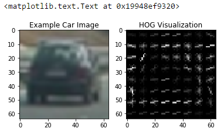
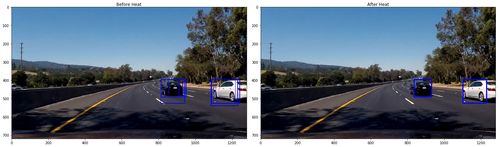
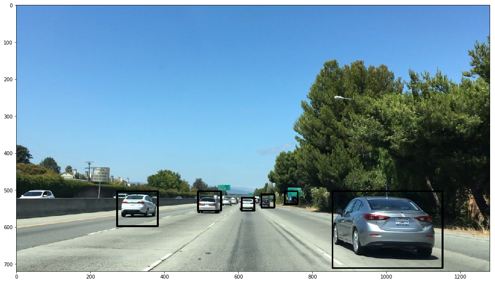

# FindingVehicles

### HOG parameters

Playing with orientations, pixels_per_cell and cells_per_block didn't give my any significant result. However, changing colourspace and number of channels was more effective, it allowed increasing SVM accuracy on ~2-3%. The interesting thing is that despite that there always was one channel for each colour space which showed much better results than 2 others, using "ALL" was still better than using it alone. My best result for classificator (I used Linear SVM) was giving following results:

Feature vector length: 5292

21.83 Seconds to train SVC...

Test Accuracy of SVC =  0.9825

Here is an illustration of HOG signature:

    

In my code you can find (sorry for the mess) method get_hog_features and illustrations of HOG signature in In[90], SVM training in In[14].
I didn't use the colour features because they allowed to make the SVM accuracy not significantly higher but in the very end it resulted into more false positives. I guess that despite splitting the set into training and validation it still caused some overfitting.

### Sliding Window Search

For sliding search I used windows 3 types of window sizes, each had its own area of search and overlapping.

Large window: 144 * 144, overlap = (0.9, 0.8), x_range = [width * 0.4 : width], y_range = [height * 0.55 : height * 0.9]

Medium window: 130 * 130, overlap = (0.9, 0.8), x_range = [width * 0.4 : width], y_range = [height * 0.55 : height * 0.8]

Small window: 96 * 96, overlap = (0.8, 0.7), x_range = [width * 0.4 : width * 0.85], y_range = [height * 0.55 : height * 0.8]

Horizontal overlap is larger than vertical since in general car width is larger than its height. So it allowed me to better cover the car object. Smaller windows have smaller ranges and are closer to horizon (due to perspective). Also, since in this video we stay in the leftmost lane, I search for cars in the right half of the image. It gives better results and I assume that it's possible to generalize since it should be possible for the car to detect on which lane it is.

After the positively classified windows are extracted I use heatmap with threshold equals to 2. The example of this pipeline result is shown below:

    

In the code, the pipeline can be found in In[30].

Since the windows search are has strict limitations, it gives almost 0 false positives.

### Video Implementation

Here is a link to the final video:

https://github.com/ashoni/FindingVehicles/blob/master/project_video_result_save.mp4

As it was said below, the pipelane looked for windows of three different sizes in particular areas of the image and then used heat map to get rid of false positives (if any) and combine overlapping boxes into one. I tried both calculating HOG features for each window in real time and precalculating it (see In[48] in code). Second way makes the video processing faster but gives more false positives and results in a lower quality in general.

### Discussion

Though I like the generated video, here are 2 thoughts:

1. It can be improved by smart calculating of the weighted average using last n frames results.

2. It's very unstable. First I did all the work for the images from the lesson. I achieved pretty good results (see the picture below) but when I ran it on the video it detected cars with much poorer quality. I had to change the window selection parameters in order to get the quality back. So I think it needs a proper camera calibration and some method to detect its position on the road first. This would allow to choose search area parameters which suit this exact landscape.

    

